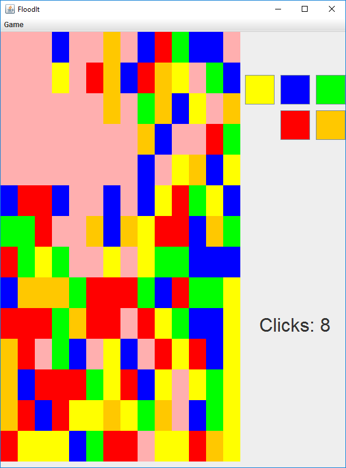

# FloodIt

In FloodIt you are given a board of randomized
colors. The objective is to make the whole 
board one color. You do this by alternating
the color of the top left corner to match
the colors near it.

